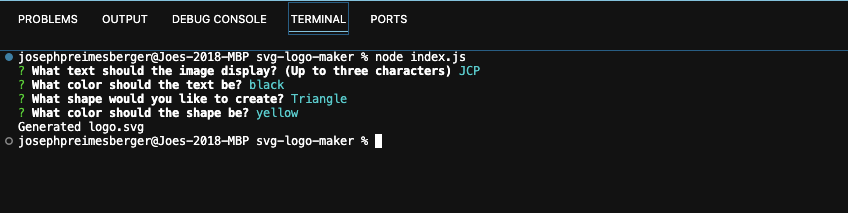

# Professional SVG Logo Maker

## Description

The purpose of this project is to build a Node.js command-line application that takes in user input to generate a logo and save it as an SVG fileLinks to an external site. The application prompts the user to select a color and shape, provide text for the logo, and save the generated SVG to a .svg file.

The application includes Triangle, Circle, and Square classes, as well as tests for each of these classes using Jest.

## Installation

A video showing the functionality of this project can be found here: https://drive.google.com/file/d/1jRvEG5tqcqqbcR_o7aJ-d2EgT0eYNLLT/view

## Usage

The application takes in user input as shown in the following screenshot:

The finished SVG file will appear as it does in the following screenshot:

## Credits

N/A

## License

Copyright (c) 2023 Joe Preimesberger

Licensed under the MIT license.